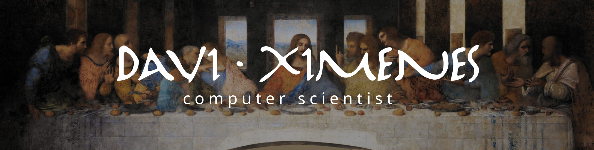

<!DOCTYPE html>
<html lang="en">
<head>
  <meta charset="UTF-8">
  <meta name="viewport" content="width=device-width, initial-scale=1.0">
  <title>Meu README</title>
  <link rel="stylesheet" href="style.css">
</head>
<body>

Hello World! 🌎

My name is Davi Ximenes. A brazilian computer scientist and software developer, here you will find my bests codes

Tech Stack 📚 

Statistics 🤓

</body>
</html>
